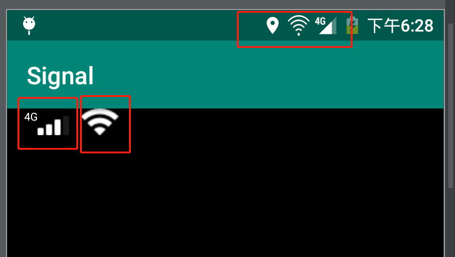

```xml
    <com.zft.signal.SignalView
        android:layout_width="wrap_content"
        android:layout_height="wrap_content"
        app:layout_constraintLeft_toLeftOf="parent"
        app:layout_constraintTop_toTopOf="parent" />
```

直接xml引用即可